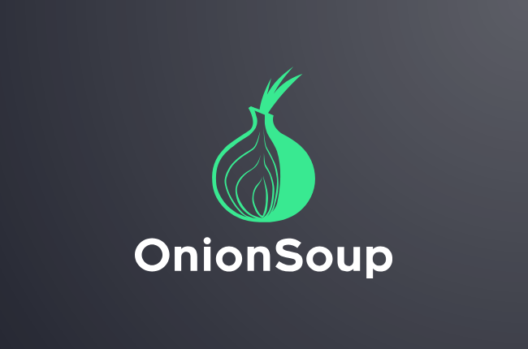

<p align="center">
  
</p>

OnionSoup is a message encryption application that uses asymmetric RSA or PGP cryptography to protect and verify communications between users without exposing a shared secret or contacting a centralized server.  It is designed to provide a simple and secure way for users to communicate with each other without exposing their identities to a third party. OnionSoup uses Tor and the Tor Onion Service to route all traffic through the Tor network, which provides a layer of anonymity that is not possible over clearnet. 

It is written in Go using the Fyne toolkit to provide a native application for Windows, Mac, and Linux. Prebuilt binaries are included for each operating system, but you can also build them yourself with the instructions below. Please note, if you want to use the live conversation feature, **you will need to have Tor installed and accessible from the command line**.

*OnionSoup is still under heavy development. Bugs will be present, and the API may change and become incompatible with old versions.*
## Usage

### Conversations


### Single Messages


### Generating Keys 


## Starting a Conversation
This example highlights how 2 parties (Alice and Bob), can bootstrap a conversation without exposing a shared secret or their identity. To create a conversation:
1. Alice and Bob generate their public and private keys and bootstrap their perspective conversation server.
2. Alice and Bob exchange their public keys over the clearnet or tor. 
3. Either party now can generate a conversation bootstrap token and send it to the other party over the same channel as the public keys (for our example, Alice will send the bootstrap token to Bob).
4. After receiving the bootstrap token, Bob pastes the bootstrap token into the start conversation dialog and submits the request. When the request is submitted, a bootstrap sequence will start and attempt to establish a secure messaging channel between the parties bidirectional over Tor. 
5. The session will remain open until either party closes their session, which will terminate the conversation.

## Installation

### Linux
1. Download the prebuilt `tar.xz` from the Release page and extract it.
2. Install tor using the package manager (IE `sudo apt install tor`).
3. Run `make user-install` 
4. Open OnionSoup!

### Windows
1. Download the prebuilt `exe.zip` from the Release page and extract it.
2. Download and install the tor expert bundle from [here](https://www.torproject.org/download/tor/) and start the daemon service with `c:\Tor\tor.exe –-service install`
3. Open OnionSoup!

### Mac
*Mac Builds are currently not working, please see [this issue](https://github.com/JustinTimperio/onionsoup/issues/1)*

## Building from Source

To bundle the assets into the program run:
```bash
~/go/bin/fyne bundle -package data -o data/bundled.go data/assets
```

### Linux
```bash
~/go/bin/fyne-cross linux -arch=amd64,arm64 -app-id="OnionSoup"
```

### Windows
```bash
~/go/bin/fyne-cross windows -arch=amd64,arm64 -app-id="Onion.Soup"
```

### Mac
*Mac Builds are currently not working, please see [this issue](https://github.com/JustinTimperio/onionsoup/issues/1)*
```bash
~/go/bin/fyne-cross darwin -arch=amd64,arm64 -app-id="Onion.Soup" --macosx-sdk-path /full-path/macos-sdk/MacOSX15.2.sdk
```


## Design

### Components
OnionSoup is made possible by these amazing projects:
- [Go](https://go.dev/)
- [Tor](https://www.torproject.org/)
- [Bine](https://github.com/cretz/bine)
- [Fyne](https://fyne.io/)
- [Echo](https://echo.labstack.com/)
- [gopenpgp](https://github.com/ProtonMail/gopenpgp)

### Message Flow


## Contributing
Feel free to help out when:

- Reporting a bug
- Discussing the current state of the code
- Submitting a fix
- Proposing new features

### We Develop with Github
We use github to host code, to track issues and feature requests, as well as accept pull requests.

### All Code Changes Happen Through Pull Requests
1. Fork the repo and create your branch from `master`.
2. If you've added code that should be tested, add tests.
3. If you've changed APIs, update the documentation.
4. Ensure the test suite passes.
5. Make sure your code lints.
6. Issue that pull request!

### Any contributions you make will be under the MIT Software License
In short, when you submit code changes, your submissions are understood to be under the same [MIT License](http://choosealicense.com/licenses/mit/) that covers the project. Feel free to contact the maintainers if that's a concern.

### Report bugs using Github's [Issues](https://github.com/JustinTimperio/onionsoup/issues)
We use GitHub issues to track public bugs. Report a bug by opening a new issue; it's that easy!

### Write bug reports with detail, background, and sample code
**Great Bug Reports** tend to have:

- A quick summary and/or background
- Steps to reproduce
  - Be specific!
  - Give sample code if you can.
- What you expected would happen
- What actually happens
- Notes (possibly including why you think this might be happening, or stuff you tried that didn't work)